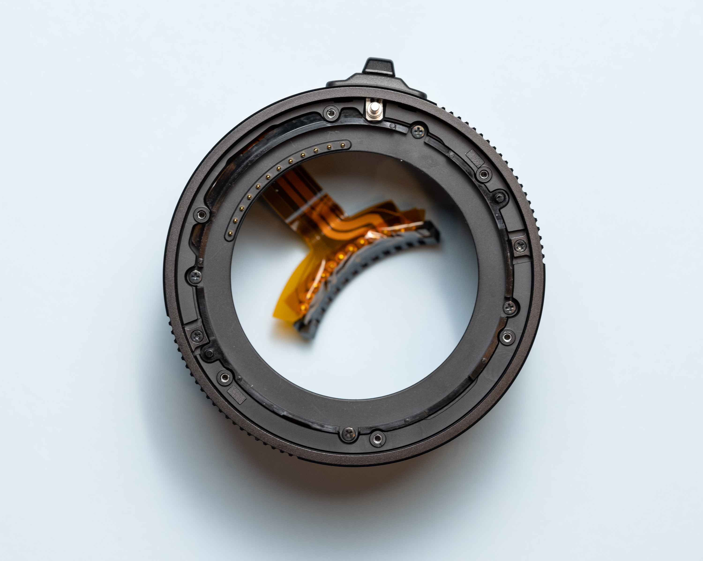

# GF Mount Electrical Notes

[`springboard`](./springboard) contains PCB design files for a pogo-pin based breakout used to electrically interface with a lens.

General documentation below.

# Basics

The electrical connections between the body and lens are made with 12 spring loaded contacts (body) which mechanically align with 11 contact rectangles (lens).

## Body Side

- Spring-loaded pins are on the body side, flat pads are on the lens side.
- The spring section of the pins have a 1.0 mm diameter, and a maximum achievable travel of 0.8mm.
- The spring pins have a conical/round tip.
- The pins are gold.
- The pins are spaced 6° apart, for a total span/range of 66°. There is no pin on the vertical from the mount center-point, the outermost edge pins are aligned at +33° and -33° from the vertical datum.
- The mount (metal ring/bayonet assembly) is electrically common with the exposed metal inside the battery compartment, and `Pin 5` and `Pin 6`.

## Lens Side

- The lens-side contacts are 1.6 x 1.3 mm rectangular pads, with the long edge aligned tangentially to the circular mount.

- When looking at the back of the lens mount, the right-most pin is a 1.3 mm x 1.3 mm square contact.

- For ease of convention, I'll label this square pad as `Pin 1`, though I don't know what the official Fuji nomenclature is.

- Based on this numbering scheme, `Pin 5` and `Pin 6` are mechanically the same contact rectangle, and therefore electrically common.

- Unlike the body side mount, the lens mount/bayonet is not electrically common with `Pin 5` and `Pin 6`.

# Poking the MCEX-45G

The extension tube provides probable contacts for both sides of the mount.

Flange to flange conductivity doesn't seem to be something that's explicitly designed for, most mating surfaces on the extension tube are anodised (therefore not conductive by contact), so the electrical path is likely through the mounting screws.

The camera-side electrical connections are larger through-hole style slugs which are soldered to the flex PCB and covered with some high quality kapton tape.

The lens-side pins are more complicated. The spring contacts are actually a bespoke assembly that Fuji has designed, they don't use COTS style pogo-pins. 

- Small copper or gold (plated?) pins slide in the plastic ring.
- The flex PCB has circular exposed pads on fingers which contact the back of the gold pins. 
- An injection molded plastic retainer contains individual springs for each contact (12 in total).
- I'd recommend strongly avoiding pulling this sub-assembly apart. There are no features to retain or guide the springs, instead, the plastic retainer has 12 tiny holes presumably used with a jig during factory assembly. I had to make my own jig with needles.

After inspecting the flex PCB,  we can assume the substantially thicker traces are used on Pins 2 through 6 are used for power delivery and grounding.

- The extension tube's electrical connections are a straight 1:1 passthrough,

- therefore, the camera cannot distinguish if the tube is attached.

- Electrical connections appear to be direct connections - measurements below are subject to  measurement error.

  | Pin-Pin           | Resistance (Ω) |
  | ----------------- | -------------- |
  | Flange            | 0.14           |
  | 1 (square)        | 0.32           |
  | 2                 | 0.08           |
  | 3                 | 0.13           |
  | 4                 | 0.12           |
  | 5 (joined with 6) | 0.05           |
  | 6 (joined with 5) | 0.08           |
  | 7                 | 0.23           |
  | 8                 | 0.20           |
  | 9                 | 0.25           |
  | 10                | 0.28           |
  | 11                | 0.27           |
  | 12                | 0.29           |

The extension tube was reassembled and tested working without issue. Assembly is mostly uneventful if the lens side contact springs are left alone. The whole process took about 3-4 hours.

# Modifying the MCEX-45G for interactive instrumentation

After dissasembly (again), the external ring and internal column were taped up to avoid scratches, and marked for a drilled hole.

A 1.0mm pilot hole was drilled, followed by a 4.5mm bore. This was repeated for both cylindrical pieces. The holes were then de-burred and tape removed.

The kapton tape protecting the through-hole pins from the body-side contacts was removed.

Silicone flying leads were soldered to the back of the flex.

Fresh kapton tape was applied to protect the solder joins from electrical contact with the tube/mount.

After full assembly, the assembly was tested with the camera/lens to ensure no loss of operation.

The flying leads were crimped for a female 2.54mm header strip.

This process took about 2-3 hours.

# Electrical Behaviour

Oscilloscope traces and logic-analyser capture to give context to the basic behaviour.

- All tests use the GFX50R and GF45mm with MCEX-45G.
- The camera has shutter-speed set to 1/125th, ISO 100, normally F4, 
- The camera was running from the internal battery only.
- Grounding for the scope/logic analyser is through Pins 5 and 6 respectively.

The LA capture below shows a simple sequence covering power on, focus, focus+photo, power off.

Pin names are listed in the left-hand column, and the timing markers along the top timeline have annotations matching their number/colour in the right-hand sidebar.

## Test Description

Voltage measurements taken with Keithley 2701 (front panel, 2 wire setup).

Scope set to rising/falling trigger at 100mV, 1V/div and 5ms/div.

Each pin was tested with the camera off, then turned on, autofocus engaged, then camera was turned off.

The ground was assumed to be Pin 5 based on:

- Higher current traces in MCEX-45G.
- Common with Pin 6 on lens mount side.
- Electrically common (v.low resistance to Pin 6 and GFX body-side mount).

### No lens connected

GFX 50R with MCEX-45G. No lens mounted.

| Pin  | Voltage  | Scope/Notes                                                  |
| ---- | -------- | ------------------------------------------------------------ |
| 1    | 3.3V     | Goes high when camera turned on, slow fall when camera turned off. |
| 2    | ~10mV    | -                                                            |
| 3    | ~10mV    | -                                                            |
| 4    | ~0.003mV | -                                                            |
| 5    | -        | Used as ground connection.                                   |
| 6    | 0mV      | Electrically common to Pin 5.                                |
| 7    | 8mV      | -                                                            |
| 8    | 8mV      | -                                                            |
| 9    | 8mV      | -                                                            |
| 10   | 7mV      | -                                                            |
| 11   | 8mV      | -                                                            |
| 12   | 15mV     | -                                                            |

### GF45mm connected

GFX 50R with GF 45mm f2.8 via MCEX-45G.

| Pin  | Voltage |               | Scope/Notes                                                  |
| ---- | ------- | ------------- | ------------------------------------------------------------ |
| 1    | 0V      |               | Never triggers scope, even with varied settings. Acting as (part of) lens detect? |
| 2    | 5.32V   |               | Just DC.                                                     |
| 3    | 6.72V   |               | Just DC.                                                     |
| 4    | 8.01V   |               | Just DC. Minor ~100mV ripple when focus motor engages.  |
| 5    | -       | -             | Used as ground connection for scope                          |
| 6    | -       | -             | Electrically common to Pin 5                                 |
| 7    | 3.4V    | Normally high | Infrequent squarewave behaviour. No immediately recognisable pattern. |
| 8    | 3.38V   | Normally high | High speed edges, infrequently triggered. Pulses LOW for approx 100-350ns at a 10ms interval. |
| 9    | 0V      | Normally low  | Squarewave, role unclear but probably data line.             |
| 10   | 3.3V    | Normally high | Squarewave, obviously a clock line at 1.5MHz. Used periodically. |
| 11   | 0V      | Normally low  | Squarewave, obvious data line.                               |
| 12   | 3.3V    | Normally high | Squarewave, no discernable pattern. Seems to go low when iris closes. |

## Pin 7

- Trace is captured after the camera was asked to focus on an object. 
- Logic level. Normally high.
- No obvious pattern, but is mostly likely related to AF lens motor activation.

## Pin 10

- 1.5Mhz squarewave on Pin 10.
- Logic level. Normally high.
- Is assumed to be a SPI style clock. 

## Pin 11

- Pin 11 appears to behave like a SPI style data line. 
- Logic level. Normally low. 

## Pin 12

- Iris ring on lens is being twisted slowly by hand.
- Logic level. Normally high.
- Correlates to iris inside the lens closing. The short flickers in this trace anecdotally match the sound of the iris, and the exposure-flicker behaviour of the EVF as the camera adjusts.

