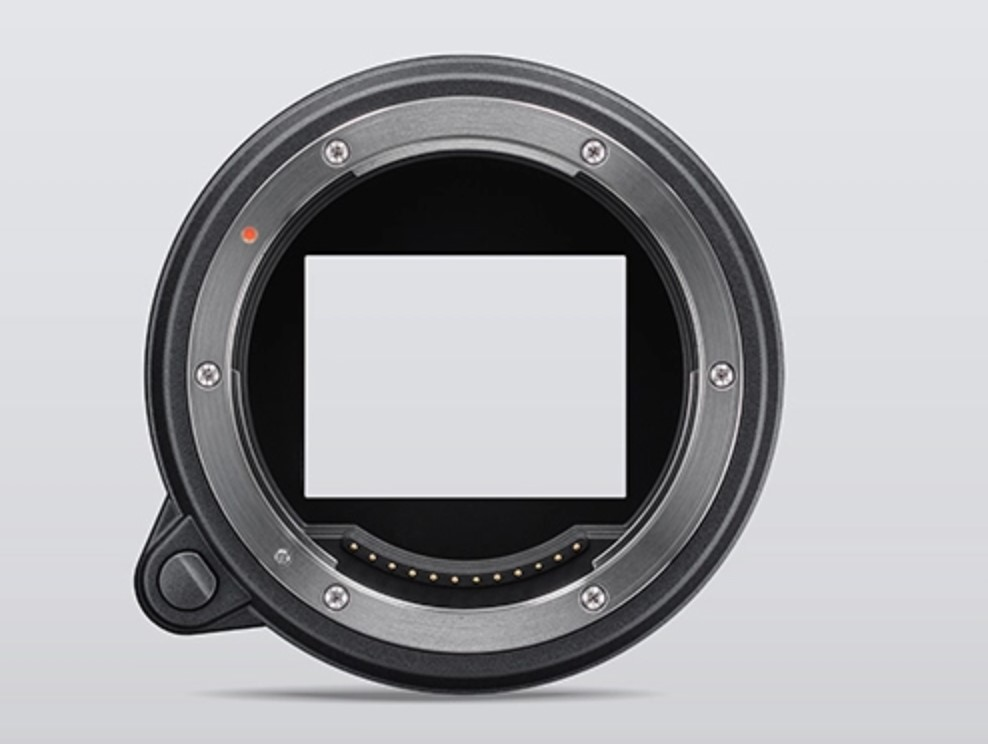
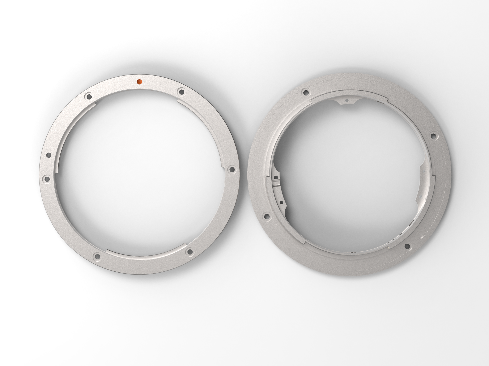
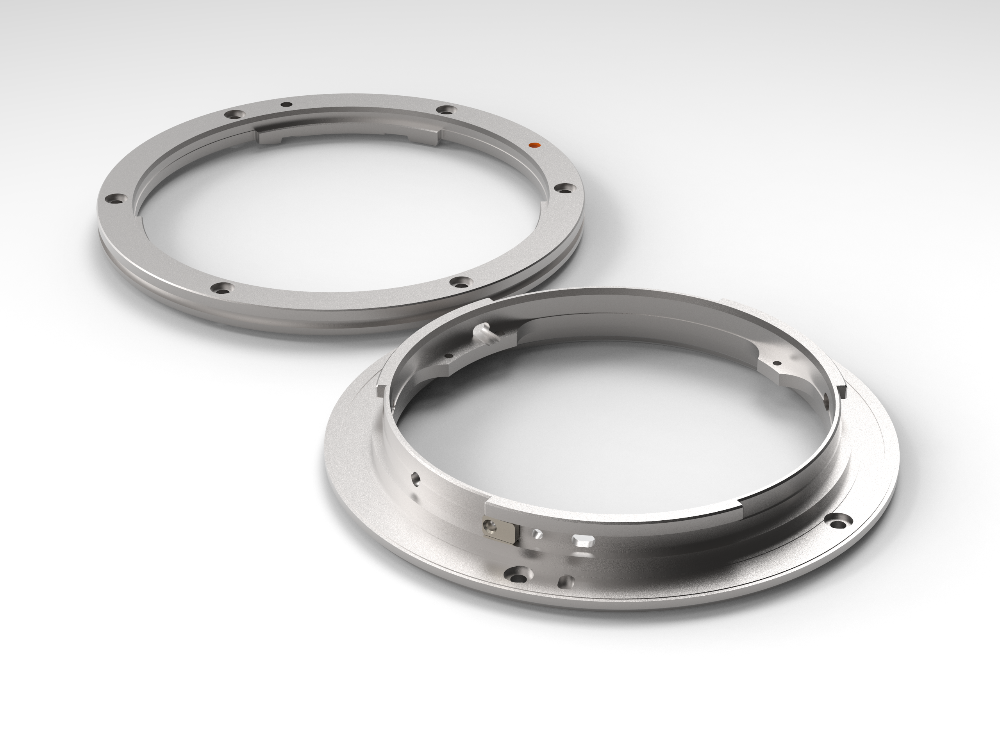
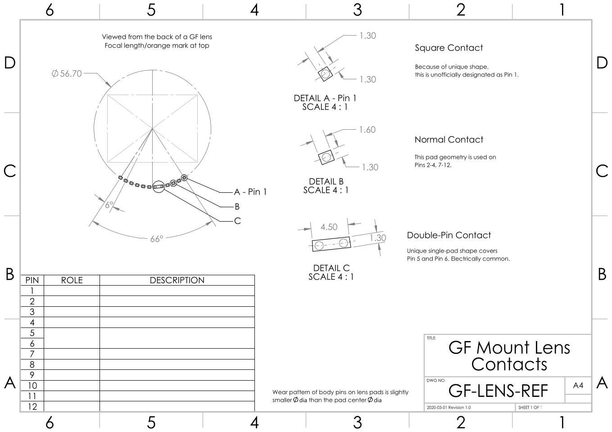

# GF Mount Notes

This section covers the mechanical specifics involved in mounting a lens/body to existing GF mount lenses/bodies.

Where possible, 3D models strive for accuracy against first-party geometry, but due to the complex nature of some parts there is no guarantee of dimensional or tolerance perfection.

Additionally, while the models for machinable parts are accurate, little is known of the specification of the various screws as most are smaller than I'm able to accurately identify.

>  Custom fastener choice is recommended if mounting to custom assemblies.

## Mounting Faces

Measured off a disassembled MCEX-45, the front and back face 'flange' parts are all that's required to mechanically couple with existing GF mount hardware.

The design and manufacture of the external mounting faces with the 45mm extension tube is externally identical to the geometry on the GF45 and GFX50R.

> Models match first party parts more accurately than required for 3rd party mounts. The internal geometry and stepped internal faces can be simplified.

The two mating parts were tested for mechanical compatibility and tolerance with a physics simulation, and tolerances in the mated 3D models match the physical mounts checked with a spring-steel feeler-gauge.

Renders below:

Based on the part's surface finish and geometry, it's assumed that the lens mount 'male' is 4-axis machined, or likely turned on a lathe with live tooling.

The body mount has internal features which suggest casting, with post-machining of the front face and internal + external cylindrical faces.

The body mount has a thin (0.3 mm) stainless shim with bent metal tabs to provide preload against a mating lens. This shim is modelled but does not feature accurate tab bends (just do it by hand).

As a general note, it's probably cheaper to cannibalise the mounts from first party extension tubes, than it would be to send a pair for CNC machining due to the complicated geometry.

## Electrical Contacts

The contacts are also provided as a reference drawing, and in DXF format suitable for use with PCB design software to create custom pin array boards.

