# GF Protocol Notes

Sniffing of the communications between the body and lens is achieved with a modified MCEX-45G, and builds from the basic electrical analysis described in [the electrical README](/electrical).

This document has been reworked several times as my understanding of the protocol has developed. Apologies for mixed 'exploratory log' and 'findings' which sometimes includes extra information.

### Logic Analyser Captures

Useful trace files are committed to the `captures` folder. Most analysis was done against the GF45 dumps, with later checks against the GF110.

These files require Saleae's Logic 2 tool for viewing. It's freely available for download on their website [here](https://www.saleae.com/downloads/).

Specific packets or sections of interest are converted into a more digestible form and are saved in `/packet-captures` as hex encoded binary files.

# SPI Communication

We can make the assumption about the specific IN/OUT pins because there ares in the logic captures which show one-way initial send packets, and occasional one-way responses.

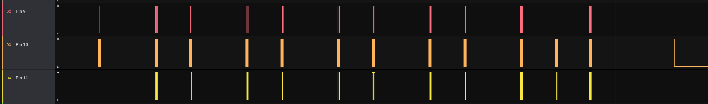

Based on this, we can assume that:

- Pin 9 is body's DATA OUT line.
- Pin 10 is a 1.5MHz SPI-style clock signal.
- Pin 11 is the body's DATA IN line.

With this in mind, we now aim to identify the properties of the communications bus and determine that it uses typical SPI instead of some Fuji special sauce.

- A transaction consists of 32-bits at minimum
  - Almost all transactions are 32-bits long.
  - During startup, a pair of 1048-bit long transactions occur with a 3ms gap - these are the longest identified transactions.
  - As the division of  `1048` and the potential bits-per-transfer should be an integer, we can reasonably throw out `16` and `32` bit transfer sizes.

By manually inspecting logic captures, one example section helps determine the clock behaviour.

- The clock is high when inactive (CPOL = 1).
- Data is valid on the clock's trailing edge (CPHA = 1)
  - Demonstrated by the edges on the first falling edge, and on falling edges aligned to 8-bit sequences.
    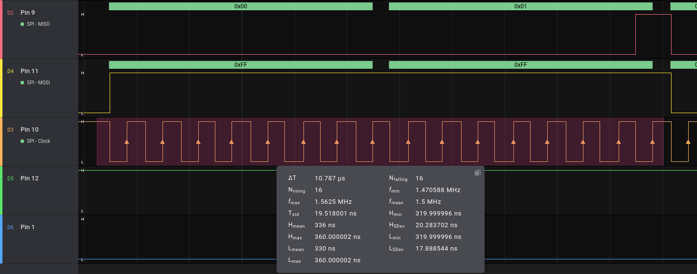

As with typical SPI busses working with bidirectional transfers, there a fairly visible 1-packet delay between the body writing a field and the lens response.

When I'm listing tx/rx pairs in a given transaction in this document, that offset isn't included unless specified.


# Packet Exploration

This is mostly done manually from packet captures of specific actions. Refer to the `/protocol/captures/` folder for the raw captures and descriptions of the setups.

## 'Idle' Packets

When the camera is powered on but is otherwise sitting idle, we see a burst of transactions occur every 40ms. These might not actually be idle, but they don't appear to change with iris control ring, current iris value, or focus ring movement.

These packets represent the bulk of 'noise' when watching packet traces, so understanding, decoding and then filtering them represents a worthwhile effort.

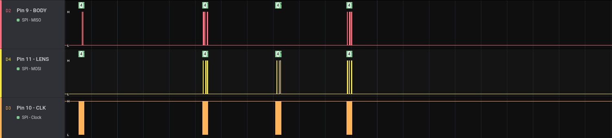

| Transmission # | Camera                | Lens                  |
| -------------- | --------------------- | --------------------- |
| 1              | `0x00 0x00 0x08 0x20` | -                     |
| 2              | `0x?? 0x10 0x80 0x??` | `0x08 0x00 0x88 0x32` |
| 3              | -                     | `0x03 0x80 0x08 0x3C` |
| 4              | `0x08 0x00 0x88 0x??` | `0x?? 0x00 0x80 0x??` |

On every third burst, we have 2 additional transactions for a 6 transaction 'group'.

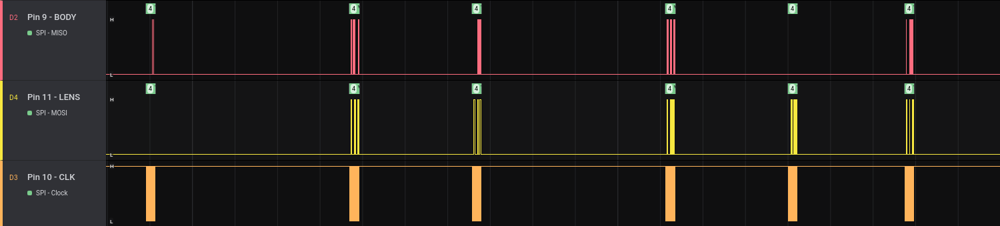

| Transmission # | Camera                | Lens                  |
| -------------- | --------------------- | --------------------- |
| 1              | `0x00 0x00 0x08 0x20` | -                     |
| 2              | `0x?? 0x10 0x80 0x??` | `0x08 0x00 0x88 0x32` |
| 3              | `0x00 0x00 0x09 0xA6` | `0x03 0x80 0x08 0x3C` |
| 4              | `0x?? 0x00 0x88 0x??` | `0x?? 0x00 0x89 0x??` |
| 5              | -                     | `0x00 0x15 0x09 0x9A` |
| 6              | `0x08 0x00 0x89 0xB8` | `0x?? 0x00 0x80 0x??` |

For both the 4 and 6 packet bursts, the first bytes marked as `0x??` seem to vary between subsequent bursts, but a random sampling of 5 bursts in a row gives a feel that they're not immediately exhibiting packet counting behaviour.

> The final bytes marked `0x??` were not understood when this was written and were left alone due to their percieved unstable nature.


> Newer analysis pass from GF110 idle capture


| Count | Lens | Burst length | Kind | Signature |
| ---: | --- | ---: | --- | --- |
| 164 | `GF110` | 4 | `masked` | `00 00 08 ??/- | n 10 80 ??/n 00 88 ?? | -/00 80 08 ?? | n 00 88 ??/n 00 80 ??` |
| 83 | `GF110` | 6 | `masked` | `00 00 08 ??/- | n 10 80 ??/n 00 88 ?? | 00 00 09 ??/00 80 08 ?? | n 00 88 ??/n 00 89 ?? | -/00 12 09 ?? | n 00 89 ??/n 00 80 ??` |
| 42 | `GF110` | 6 | `exact` | `00 00 08 20/- | 08 10 80 22/08 00 88 32 | 00 00 09 a6/00 80 08 24 | 09 00 88 3a/08 00 89 b8 | -/00 12 09 b8 | 08 00 89 b8/09 00 80 1a` |
| 41 | `GF110` | 4 | `exact` | `00 00 08 20/- | 0a 10 80 32/08 00 88 32 | -/00 80 08 24 | 08 00 88 32/0a 00 80 22` |
| 41 | `GF110` | 4 | `exact` | `00 00 08 20/- | 0b 10 80 3a/08 00 88 32 | -/00 80 08 24 | 08 00 88 32/0b 00 80 2a` |
| 41 | `GF110` | 4 | `exact` | `00 00 08 20/- | 0e 10 80 12/08 00 88 32 | -/00 80 08 24 | 08 00 88 32/0e 00 80 02` |
| 41 | `GF110` | 4 | `exact` | `00 00 08 20/- | 0f 10 80 1a/08 00 88 32 | -/00 80 08 24 | 08 00 88 32/0f 00 80 0a` |
| 41 | `GF110` | 6 | `exact` | `00 00 08 20/- | 0c 10 80 02/08 00 88 32 | 00 00 09 a6/00 80 08 24 | 0d 00 88 1a/0c 00 89 98 | -/00 12 09 b8 | 08 00 89 b8/0d 00 80 3a` |


## Identification Packets

After the camera is powered on, a series of `131B` transactions occur (each sent twice 3ms apart). Both transmissions appear to have identical payloads.

### GF45mm

The first transaction starts the first two bytes with `0x00 0x00`, and ends with `0xAF`.

The second transaction starts with `0xFF 0xFF` and ends with `0xAD`.

The payload (in hex) is:

```
4c52 3130 3641 0000 4653 534e 5730 3036
4746 3435 6d6d 4632 2e38 2052 2057 5200
0000 0000 0000 0000 0000 0000 0000 0000
0000 0000 0000 0000 0000 0000 0000 0000
0000 0000 0000 0000 0000 0000 0000 0000
3234 3033 3338 3636 3035 0156 0100 0100
0100 0100 c801 0000 0000 0000 0000 0000
0000 0000 0000 0000 0000 0000 0000 0000
```

These transactions are from the lens to the body and **describe the lens**. 

- The first section of data is ASCII: `LR106A  FSSNW006GF45mmF2.8 R WR` 
  - Not sure what the first half means yet.
  - The last half is obvious obvious, the lens is officially labelled as  `GF45mmF2.8 R WR`.
- The second block of data in the payload is `2403386605 V` `È` in ASCII, which isn't immediately obvious
  - TODO work out what this data means?

### GF110mm

The first transaction starts the first two bytes with `0x00 0x00`, and ends with `0x0B`.

The second transaction starts with `0xFF 0xFF` and ends with `0x09`.

The payload (in hex) is:

```
4c52 3130 3441 0000 4653 534e 5731 3034
4746 3131 306d 6d46 3220 5220 4c4d 2057
5200 0000 0000 0000 0000 0000 0000 0000
0000 0000 0000 0000 0000 0000 0000 0000
0000 0000 0000 0000 0000 0000 0000 0000
3035 4330 3030 3234 0000 0160 0110 0110
0110 0110 c801 0000 0000 0000 0000 0000
0000 0000 0000 0000 0000 0000 0000 0000
```

These transactions are from the lens to the body and **describe the lens**. 

- The first section of data is ASCII: `LR104A  FSSNW104GF110mmF2 R LM WR`
  - Not sure what the first half means yet.
  - The last half is obvious, the lens is officially labelled as `GF110mmF2 R LM WR`.
- The second block of data in the payload is `05C00024` `È` in ASCII
  - TODO work out what this data means

### GFX50R

> These body identification packets occur somewhat later than the lens identification packets, and only when the `GF110mm` is mounted.

The first transaction starts the first two bytes with `0x00 0x00`, and ends with `0x19`.

The second transaction starts with `0xFF 0xFF` and ends with `0x17`.

The payload (in hex) is:

```
5350 5833 0000 0000 0000 4746 5820 3530
5200 0000 0000 0000 0000 0000 0000 4746
5820 3530 5200 0000 0000 0000 0035 3933
3533 3433 3833 3633 3131 3831 3131 3339
3744 3031 3031 3130 3834 3102 2001 3501
0001 0001 0000 0000 0000 0000 0000 0000
0000 0000 0000 0000 0000 0000 0000 0000
0000 0000 0000 0000 0000 0000 0000 0000
```

These transactions are from the body to the lens and **describe the body.** 

- The first section of data is ASCII: `SPX3` `GFX 50R` `GFX 50R` (whitespace trimmed)
  - Unsure of what `SPX3` represents.
  - The repeated pair of `GFX 50R` string sequences match the body under test.
- The second section of data is unknown.
  - `59353438363118111397D010110841   5` in ASCII, with some unprintable bytes
  - Unknown data


## Aperture Control Ring

From the large set of lens iris change captures, a pattern across the captures started to be more obvious in the packets sent from the lens to the body (i.e. body rx):

```
rx 00 02 0c xx
rx 00 03 0c xx
rx 00 04 0c xx
...
rx 00 10 0c xx
...
rx 00 16 0c xx
```

The body requests it with `00 00 0c xx` and specifically clocks a transaction for readout as `tx 00 00 00 00` is observed during these packets. It's currently unclear if there's a 'data ready' or 'state dirty' flag that triggers the poll.

The `0c` command is also used for focus ring incremental readout, but the **top two bits of the last byte are always low for iris ring packets**, `bit 6..7 = 00`.

Sequenced something like this:

```
tx 00 00 0c ??       body asks for aperture-index state
rx 00 XX 0c ??       lens reports aperture ordinal value
tx/rx n 00 8c ??     ACK
rx n 00 80 ??        unsure, final status/result
```

If I encoded a hypothetical index to each accessible f-stop position on the GF45mm control ring (and retrospectively 1-index it):

```
01 = f/2.8
02 = f/3.2
03 = f/3.6
04 = f/4
05 = f/4.5
06 = f/5
07 = f/5.6
08 = f/6.4
09 = f/7.1
0a = f/8
0b = f/9
0c = f/10
0d = f/11
0e = f/13
0f = f/14
10 = f/16
11 = f/18
12 = f/20
13 = f/22
14 = f/26
15 = f/29
16 = f/32
```

This seems to be validated with actual sniffed f-stop tests:

```
f2.8 -> f3.2   rx 00 02 0c 32
f3.2 -> f3.6   rx 00 03 0c 12
f3.6 -> f4.0   rx 00 04 0c 34
...
f29 -> f32     rx 00 16 0c 06
```

On the GF110mm which has f2.0 to f22 range, there's the same number of third-stops over the range, they map against index the same way.

> There are lenses in the GF ecosystem such as the 80mm f1.7 to 22 which should have more configurable apertures? Are there lenses with fewer?

Plotting the values during the 'sweep' captures shows the transitions.

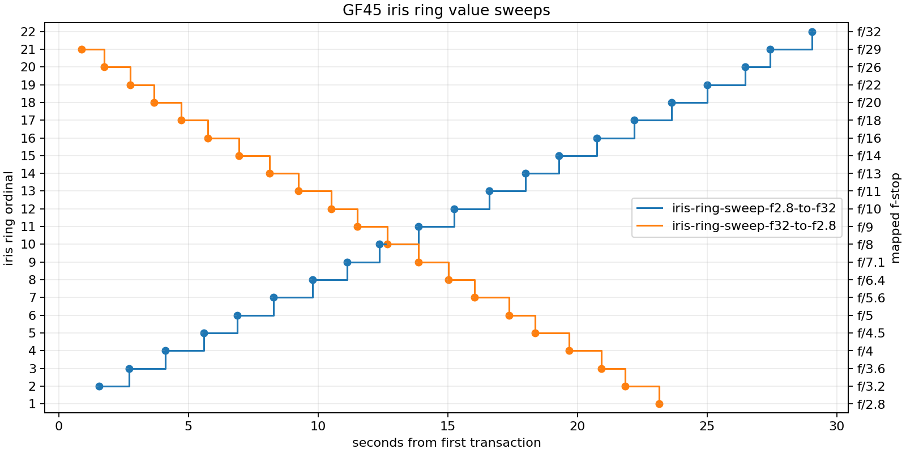

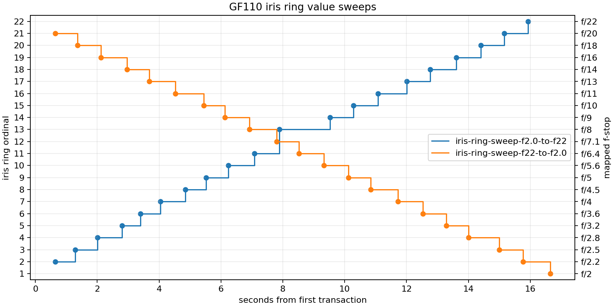

Now there's a known packet behaviour `00 XX 0c YY`, poking at the relationship(s) to the final byte may be easier?

A larger observation example set:

```
00 01 0c 10
00 02 0c 32
00 03 0c 12
00 04 0c 34
00 05 0c 14
00 06 0c 36
00 07 0c 16
00 08 0c 38
00 09 0c 18
00 0a 0c 3a
00 0b 0c 1a
00 0c 0c 3c
00 0d 0c 1c
00 0e 0c 3e
00 0f 0c 1e
00 10 0c 00
00 11 0c 20
00 12 0c 02
00 13 0c 22
00 14 0c 04
00 15 0c 24
00 16 0c 06
```

The lenses also have a `A` automatic mode selection position and a `C` custom position for camera-side control over the aperture. I forgot to capture these with the GF45, but did with GF110.

When entering AUTO there was less/no *obvious* packet behaviour as it also doesn't allow dof-preview.

I noticed a 'new' `00 00 0c 30` packet was visible, but later review shows it in other manual iris sweeps as well.

There wasn't a visible change when clicking the ring to custom mode (camera showed f4). There was a notable change of `00 80 08 24` packets to `08 80 08 26` though?

> On X-mount, or the GF cine-zoom for Eterna, we might see different behaviour as they support de-clicked behaviour?
>
> i.e. `XF16-55mmF2.8 R LM WR II` or `XF18-120mmF4 LM PZ WR`

> TODO:
>
> - Additional captures sweeping through A and C on both lenses
> - Pull out the lens ring A/C fields to a known/confirmed state

## Focus Control Ring

The focus ring is also fly-by-wire. Because the ring isn't marked and is free to rotate infinitely, there's no easy way to capture known step values.

So a handful of captures were done to cover a range of possible packet scenarios in both manual focus mode (lens motor activates on turn), and autofocus mode where the ring isn't typically used.

- Captures with small, longer, and >revolution movements made continuously in each direction
- Captured back and forth movements, expecting to see a rough sine/triangle position trace 

After looking through the captures for unique/different packets, a packet from the lens seems to be a viable candidate for a big-endian 16-bit value:

```
rx 00 01 0c 92    +1
rx 00 04 0c b6    +4
rx 00 08 0c ba    +8

rx ff ff 0c 8c    -1
rx ff fb 0c 88    -5
rx ff f8 0c a6    -8
```

- Clockwise captures are positive values, counterclockwise are negative.
- They are relative values, showing larger values in the 'fast' rotation captures.
- They aren't published/polled at a different rate based on change.
- The behaviour appears the same on the GF45 and GF110mm lenses, even though the GF110 has a much longer throw.

The **body polls the increment value** with `00 00 0c b2`, and the lens responds two transactions later.

```
tx 00 00 0c b2       request ring state
rx 00 11 09 96       

tx 0e 00 89 a8
rx 0d 00 8c ac       ACK the 0x0c read

tx 00 00 00 00
rx 00 04 0c b6       ring delta = +4

tx 08 00 8c 84       ACK the 0x0c value?
rx 0e 00 80 02       Possible status update
```

The `0c` is also used for the iris control ring. For focus packets, the **top two bits of the last byte are always high** (`bit 6..7 = 11`).

In the captures where the manual focus mode was active and the motor would move, we see additional `0x15` packets which are documented in the focus motor section.

Extracting the values with timestamps and then plotting them and a running sum, gives convincing results.

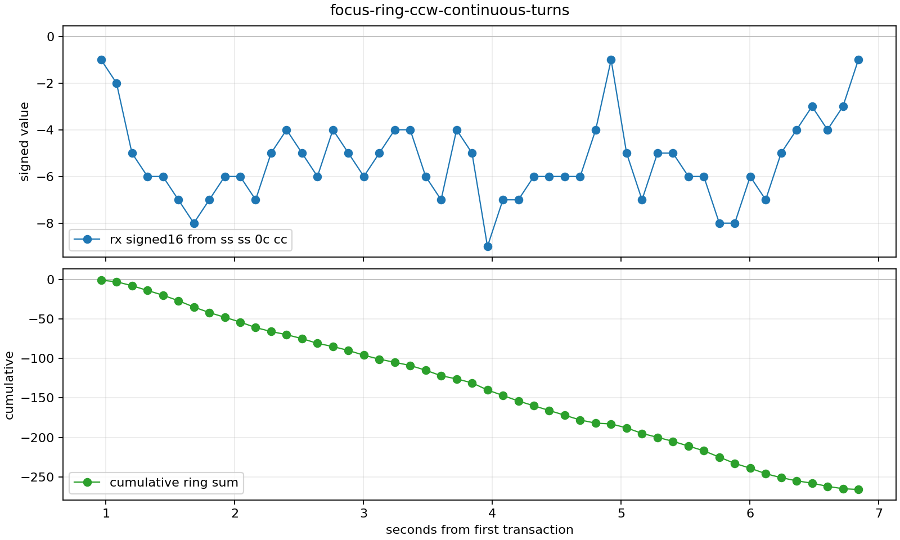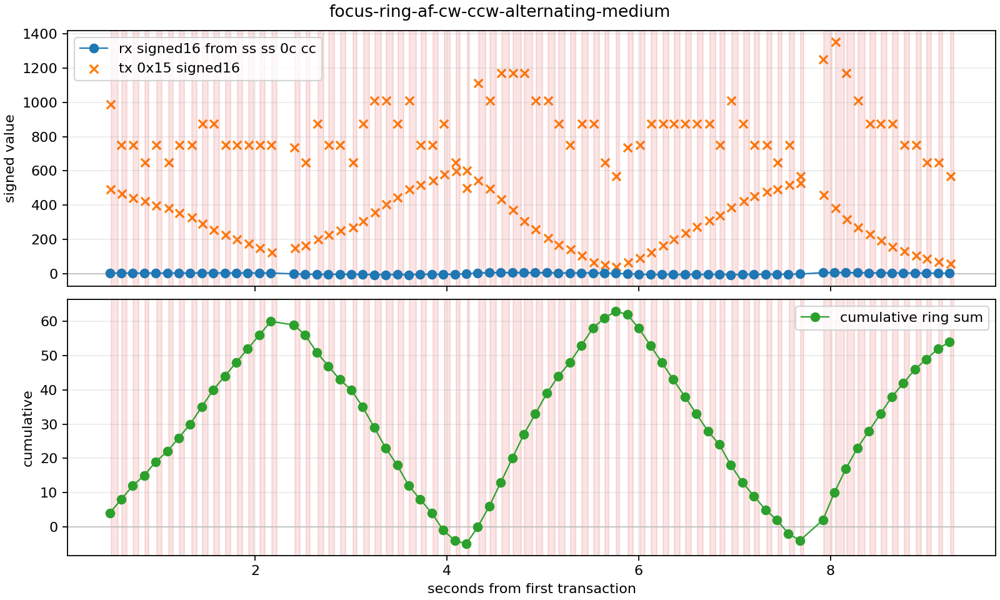

Example packets that are useful for comparison:

```
# autofocus/non-actuating, clockwise continuous turns
rx 00 01 0c 92
rx 00 02 0c b4
rx 00 04 0c b6
rx 00 08 0c ba

# autofocus/non-actuating, counter-clockwise turns
rx ff ff 0c 8c
rx ff fd 0c 8a
rx ff fb 0c 88
rx ff f6 0c a4

# manual-focus/actuating, alternating direction
rx 00 04 0c b6
rx 00 03 0c 94
rx 00 05 0c 96
rx ff ff 0c 8c
rx ff fd 0c 8a
rx ff fb 0c 88
rx 00 06 0c b8
rx 00 07 0c 98
```


## Sync/Actuate Command

From the larger dump of iris closures, the packet `00 00 3f c6` is found just before the iris closes in all cases, and around focus events. Given it's always the same, and the lens echoes it, I think it's treated as a 'execute' or 'sync' event. 

The 'upper 2' of the final byte are `3` or `11b` for this packet.

The lens acks with `n 00 bf xx` i.e. `0b 00 bf f0` immediately before the falling edge on the iris status IO.

This behaviour doesn't occur when the control ring is rotated without dof preview on, or the focus control ring rotated in auto-focus modes.

The values being acted on appear to be staged beforehand (discussed in next sections).


## Aperture Drive

The setting on the lens control ring doesn't appear to be used internally by the lens, **the body commands the iris setpoint**.

Controlling the aperture blades without changing the control ring on the lens is doable in auto mode (and forcing auto-exposure to stop down/up) and in 'custom' mode where the body ring controls the f-stop target (with dof-preview active to force it).

The concept is proven with captures which have no `00 xx 0c cc` 'ring index' packets in the GF110 auto/custom tests, but `00 00 3f c6` execute commands and the falling edge on the iris IO are visible.

The command behaviours that I could find wasn't tightly correlated to the falling edges:

- `0x18` 'staging' commands, seen in GF110 `auto-aperture-dark-to-bright-to-dark` without motor `0x15` commands.
  - The `0x18` commands are not near the IO falling edge.
  - Acknowledged with `0x98`, sharing the same execute command.
  - Lines up with most of the GF45 iris edges as well.


The sequence is typically

```
tx <staged command>     0x18 family, carries target/move information
tx feedback/ack  		n 10 80 / n 00 98 path depending on family
tx 00 00 3f c6          execute/latch
rx <staged command>     lens ack of the staged command
tx n 00 95/98 ??        family-specific acknowledgement
rx n 00 bf ??           execute response
rx 00 00 3f c6          lens echo of execute shortly after the edge/handshake
```

I also noticed that the iris IO line negative pulse that occurs when stopping down/up takes an increasing amount of time based on the 'stop distance' in the transition. I suspect this signal might indicate 'iris OK' or similar. 

> In some captures there is some minor error as the camera delayed the command for the 'smoothed' simulated viewfinder brightness.

### Setpoint

The aperture setpoint seems to be encoded inside the `0x18` command with corresponding ack from the lens.

```
tx AA BB 18 CC
tx 00 00 3f c6
rx AA BB 18 CC
```

The values in captures are somewhat tied to third-stop increments due to the camera not allowing finer settings, but the pattern looks common to both lenses and is familiar to the control ring indexing:

```
10 00 18 a8 -> index 1
10 40 18 aa -> index 2
10 80 18 ac -> index 3
10 c0 18 ae -> index 4
11 00 18 b0 -> index 5
...
15 40 18 92 -> index 22
```

Where the GF45 index 1 = f/2.8 and 22 = f/32, and the GF110 index 1 = f/2.0, index 22 = f/22.

Numerically, the encoding could be described as:
```
index = ((BE16(AA BB) - 0x1000) / 0x40) + 1
```

> When a custom controller can drive the lens, it might be worth seeing if the iris supports finer setpoint resolution?
>
> Do any of the x-mount lenses/bodies have clickless iris or finer selection controls?

### Feedback

The body sends `00 01 08 82`, and the lens appears to return `<aperture_index> 00 08 <tail>` where index seems to correlate similarly to the control ring? `00 -> f2.8` and `15 = f32` for GF45.

Same behaviour on GF110. DoF-preview enabled sweep shows the ring, camera command and feedback aligning well.

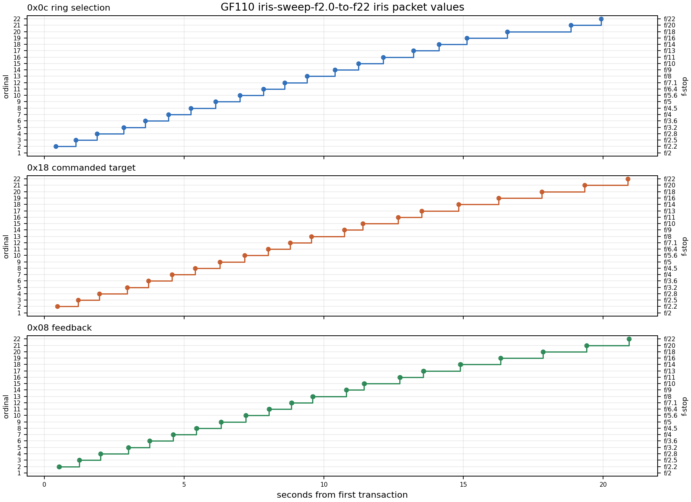

## Focus Motor Drive

Two digital lines (in captures CH1 and CH2) correlate to the focus behaviour, so inferring their purpose and correlation to data from these captures should also be doable.

We (from later passes) know the top-two bits in the last byte represent some kind of sequence/phase index. I've called it a 'tag' value here, as it seems to correlate to the behaviours.

### Packet Sequence

```
tx 03 dc 15 10       Tag 0, value 988 request
rx 00 00 00 00

tx 0f 10 80 1a       ?
rx 08 00 95 28       0x15 family ACK

tx 01 20 15 40       Tag 1, 288
rx 03 dc 15 10       Echo of Slot A request

tx 08 00 95 28       0x15 family ACK
rx 0f 00 95 62       0x15 family ACK

tx 01 ed 15 b2       Tag 2, target position 493
rx 01 20 15 40       Echo of 288 Tag 1 

tx 09 00 95 72       0x15 family ACK
rx 08 00 95 aa       0x15 family ACK

tx 00 00 3f c6       Execute/latch
rx 01 ed 15 b2       Echo of target position 493 Tag 2

tx 0a 00 95 ba       ACK/status
rx 09 00 bf e0       Execute ACK

tx 00 00 00 00
rx 00 00 3f c6       Echo of execute
```

This sequence is seen on both GF45 and GF110.

Plotting the values during a AF single-shot sequence for the captures using GF45 looks fairly reasonable.

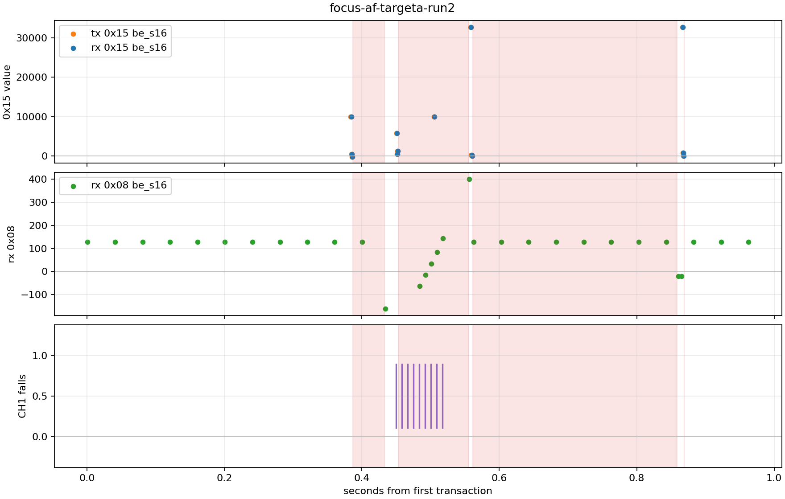

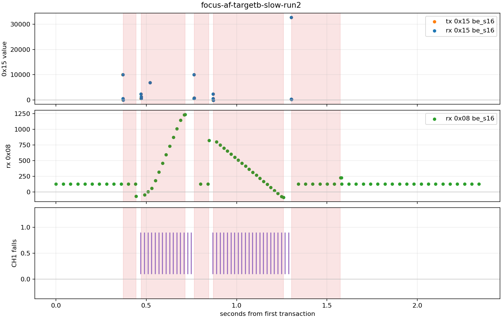

Given the focus occasionally runs at different speeds and we see some easing in the feedback position shape, I did a review pass looking for variations to understand what the likely meaning of the first and second payloads represent. 

### Duration/speed?

The value doesn't seem to correlate to previous positions or the upcoming position. There is a good linear correlation to the duration of the focus move for the smaller values, ~0.141ms/count. The 5000 value move is less correlated though and the 32767 doesn't align with motor actuation.

> Treat this as poorly substantiated correlation, need more capture data

| Tag 0 packet  | Value   | Mean CH2 low |
| ------------- | ------- | ------------ |
| `01 f4 15 18` | `500`   | ~16.6 ms     |
| `02 38 15 1e` | `568`   | ~31.4 ms     |
| `02 87 15 10` | `647`   | ~39.3 ms     |
| `02 e2 15 0e` | `738`   | ~51.4 ms     |
| `13 88 15 3e` | `5000`  | ~250.6 ms    |
| `7f ff 15 10` | `32767` | -            |


### Unknown Field

The 'tag 1' field isn't very well understood. In the slower AF captures (low light) there are fewer and longer CH2 pulses which provide the most with variation. 

- Manual focus tests all have `01 20 15 40`, the constantly seen `288` value in the longer captures. 
  - Anecdotally the focus speed/sound is the same in manual mode?
- Autofocus runs show different values:
  - GF45 and GF110 captures have the some of the same fields 

This might also relate to the mode, focus move type or curve?

| `0x15` with Tag 1 payloads (hex) | BE16 decimal |
| -------------------------------- | ------------ |
| `01 20`                          | `288`        |
| `01 21`                          | `289`        |
| `01 23`                          | `291`        |
| `02 00`                          | `512`        |
| `02 01`                          | `513`        |
| `02 03`                          | `515`        |
| `03 21`                          | `801`        |

### Target Position

Like the focus ring, the `ss ss` appears to be a **signed big-endian 16-bit position value** that makes sense. These packets are `tag 2` i.e. the final byte bits 6..7 are `11` .

On the GF45mm:

```
ff d9 15 8c -> -39    near infinity?
ff f2 15 86 -> -14
00 0a 15 a2 -> 10
02 4c 15 b6 -> 588
04 a2 15 9e -> 1186
04 d3 15 b0 -> 1235   close focus
```

The magnitude of the value sent seems to correlate to the low-pulse duration which probably represents an absolute focus target.

Also has high correlation (deltas of mostly 0, `gf45_slow_af` has 2-count difference) to the feedback value.

### Position Feedback

A feedback signal from the lens in `0x08` messages follows the BE16 format, i.e.  `rx ss ss 08 cc`. These all have tag = 1.

The feedback value is sometimes `32767` which is `2^15 - 1` and would probably be the end of the encoder's range. If that value is seen we'd treat it as a sentinel/health update but probably not a valid position.

The focus feedback values don't seem valid outside of active focus actuation regions.


### Resolution Differences

The GF110mm has a nicer ultrasonic or linear motor, and there seems to be much finer focus control available. This is backed up by focus sweep captures showing ~17x larger span of values:

| Lens  | Motor command | Width        | Resolution | Feedback range | Width        | Resolution |
| ----- | ------------- | ------------ | ---------- | -------------- | ------------ | ---------- |
| GF110 | -927 .. 22638 | 23565 counts | ~14.5 bits | -845 .. 22638  | 23483 counts | ~14.5 bits |
| GF45  | -163 .. 1235  | 1398 counts  | ~10.5 bits | -162 .. 1235   | 1397 counts  | ~10.5 bits |

The faster response of GF110 focus is also demonstrated

| Capture Group      | GF110 mean CH2 low | GF45 mean CH2 low |
| ------------------ | ------------------ | ----------------- |
| Manual focus throw | ~6.0 ms            | ~24.9 ms          |
| Normal AF          | ~39.2 ms           | ~147.9 ms         |
| Dark/slow AF       | ~44.4 ms           | ~229.0 ms         |


## Packet Structure

In wire-order most packets are 4-bytes of the form `payload payload command status` where useful payloads are typically big-endian signed 16-bit values or low value indexes.

Throughout the docs I've been treating the seemingly unstable last byte as some kind of checksum byte, but it's actually a structure/bitfield with important meaning to the underlying behaviour.

### Message/Command

The command byte (third byte sent over the wire) includes an 'ack' flag at bit 7, i.e. `cmd | 0x80`, demonstrated on most currently known packets between tx and rx.

The total group of unique command bytes observed is below, entries with listed CMD or ACK values are in captured files. Currently the possible `0x00` command has not been observed.

| CMD    | ACK/Response | Decode status                                |
| ------ | ------------ | -------------------------------------------- |
| —      | `0x80`       | Transport/status, not really decoded         |
| `0x05` | `0x85`       | Not documented/decoded                       |
| `0x06` | `0x86`       | Not documented/decoded                       |
| `0x08` | `0x88`       | Aperture/Focus feedback, mostly decoded.     |
| `0x09` | `0x89`       | Not decoded                                  |
| `0x10` | `0x90`       | Not documented/decoded                       |
| `0x0c` | `0x8c`       | Aperture/focus control ring, mostly decoded. |
| `0x0f` | `0x8f`       | Not decoded                                  |
| `0x15` | `0x95`       | Focus motor, mostly decoded                  |
| `0x16` | `0x96`       | Not documented/decoded                       |
| `0x18` | `0x98`       | Aperture setpoint, mostly decoded            |
| `0x20` | `0xa0`       | Not documented/decoded                       |
| `0x28` | `0xa8`       | Not documented/decoded                       |
| `0x2a` | `0xaa`       | Not documented/decoded                       |
| `0x3f` | `0xbf`       | Execute/latch, mostly decoded                |


### Tail/Status Byte

Originally I was calling this a checksum due to how unstable it appeared across packets. Since then it's a little better understood as a bitfield/structure with some stateful information and **it does not contain a CRC**. 

Using all the captured packets, de-duplicating and then sorting on 'command byte' and payload to find different header bytes for the same packet.

- Also filtered out all 'readout' packets that are an artifact of the SPI behaviour `00 00 00 00`.
- Assuming packets from the body and lens use the same behaviour, but the corpus tracks which device/trace the packets are seen in.

Looking over the headers, there were some under-represented bits on repeated packets with different final-bytes.

**Bit 0 is always low.** This seems to hold for *all* transactions I've captured (89,984 at time of observation). 

Luckily,  `09 00 88`  shows that **rx and tx directions can have the same final byte for an identical payload** it's less likely there's a 'camera' or 'lens' style send/recv bit in the field. This also means it's less likely that both sides are maintaining some shared incremental packet count.

The focus and iris settings use the same `0c` command byte, but when looking at the **top two bits** of the last byte, 

- Iris ring `0x0c` packets are always(?) `upper = 0` across 100+ examples.
- Focus ring `0x0c` packets are always(?) `upper = 2` across 600+ examples.
- For focus motor `0x15` packets, the upper bits evenly distribute with `00`/`01`/`10` but never `11`. 
- Execute/sync commands are `11`.

Looking at behaviour around 'most understood' packets for iris and focus there is a fairly obvious pattern in the remaining bits:

| Direction | CMD    | Prefix     | Upper-2b values | Final bits 1..5 values |
| --------- | ------ | ---------- | --------------- | ---------------------- |
| RX        | `0x0c` | `00 02 0c` | 2, 0            | `1a`, `19`             |
| RX        | `0x0c` | `00 03 0c` | 2, 0            | `0a`, `09`             |
| TX        | `0x0c` | `00 00 0c` | 2, 0            | `19`, `18`             |
| RX/TX     | `0x15` | `01 f4 15` | 0, 2            | `0c`, `0d`             |
| RX/TX     | `0x15` | `03 6b 15` | 0, 2            | `1d`, `1e`             |
| RX/TX     | `0x15` | `01 23 15` | 1, 2            | `11`, `11`             |

The table shows that with the upper bits taken into account, the remaining data in the trailing byte has a stable value and a one-bit field that varies.

Looking at the larger set of captures, only 80 of 5153 deduplicated packets have multiple tail byte options for an otherwise identical packet. When taking the upper two bits into consideration, the remaining 5 bits have fewer variations and they aren't random as expected for a signature or checksum.

This immediately **rules out sequence numbering** or global counting behaviours. And I'm now convinced the remaining field(s) do not represent any kind of checksum or signature.

Looking over the full set of packets, the remaining byte's bit 1 (or bit 0 of the 5-bit field) seems to impact the largest number of packets, responsible for the variation in 45 of 80 relevant packet examples. So pulling this bit out during review/parsing and trying to find correlations in burst sequences or with hardware behaviours is a good next step.

| Prefix     | Bits 1..5 variants | After masking bit 0 | Notes                             |
| ---------- | ------------------ | ------------------- | --------------------------------- |
| `00 00 08` | `0x10`, `0x11`     | `0x10`              | Common idle/status request shape  |
| `08 00 95` | `0x14`, `0x15`     | `0x14`              | `0x95` ACK family                 |
| `08 00 89` | `0x1c`, `0x1d`     | `0x1c`              | `0x89` ACK family                 |
| `00 01 08` | `0x00`, `0x01`     | `0x00`              | Variant of `0x08`?                |
| `00 00 0c` | `0x18`, `0x19`     | `0x18`              | Focus-ring / aperture-ring family |

Considering that bit reduces the variation on the most common packets captured:


| Prefix | Count | Variants | Bit 6..7 | Bit 1 | Remaining bits 2..5 |
| --- | ---: | ---: | --- | --- | --- |
| `00 00 08` | 36,159 | 3 | `0` -> 36,140<br>`1` -> 1<br>`2` -> 18 | `0` -> 36,140<br>`1` -> 19 | `08` -> 36,159 |
| `08 00 95` | 4,132 | 3 | `0` -> 2,790<br>`1` -> 617<br>`2` -> 725 | `0` -> 2,790<br>`1` -> 1,342 | `0a` -> 4,132 |
| `00 01 08` | 3,067 | 3 | `0` -> 107<br>`1` -> 2,690<br>`2` -> 270 | `0` -> 107<br>`1` -> 2,960 | `00` -> 3,067 |
| `0e 00 95` | 1,969 | 3 | `0` -> 622<br>`1` -> 628<br>`2` -> 719 | `0` -> 622<br>`1` -> 1,347 | `06` -> 1,969 |
| `0a 00 95` | 1,937 | 3 | `0` -> 609<br>`1` -> 615<br>`2` -> 713 | `0` -> 609<br>`1` -> 1,328 | `0e` -> 1,937 |
| `0f 00 95` | 1,838 | 3 | `0` -> 485<br>`1` -> 725<br>`2` -> 628 | `0` -> 485<br>`1` -> 1,353 | `08` -> 1,838 |
| `0b 00 95` | 1,805 | 3 | `0` -> 483<br>`1` -> 707<br>`2` -> 615 | `0` -> 483<br>`1` -> 1,322 | `00` -> 1,805 |
| `0d 00 95` | 1,489 | 3 | `0` -> 144<br>`1` -> 719<br>`2` -> 626 | `0` -> 144<br>`1` -> 1,345 | `04` -> 1,489 |
| `09 00 95` | 1,464 | 3 | `0` -> 134<br>`1` -> 713<br>`2` -> 617 | `0` -> 134<br>`1` -> 1,330 | `0c` -> 1,464 |

There are only 3 captured packets with variation in the remaining bits.

| Prefix     |  Count | Variants | Bit 6..7                                    | Bit 1                         | Remaining bits 2..5             |
| ---------- | -----: | -------: | ------------------------------------------- | ----------------------------- | ------------------------------- |
| `08 00 88` | 45,616 |        3 | `0` -> 39,458<br>`1` -> 5,658<br>`2` -> 500 | `1` -> 39,458<br>`0` -> 6,158 | `0c` -> 39,458<br>`0d` -> 6,158 |
| `0b 00 88` |  1,644 |        3 | `0` -> 1,638<br>`1` -> 2<br>`2` -> 4        | `1` -> 1,638<br>`0` -> 6      | `02` -> 1,638<br>`03` -> 6      |
| `0f 00 88` |  1,640 |        3 | `0` -> 1,635<br>`1` -> 3<br>`2` -> 2        | `1` -> 1,635<br>`0` -> 5      | `0a` -> 1,635<br>`0b` -> 5      |

It's a bit hard to tell right now if the next bit is independent, it's another two-bit field instead of just bit-1, or if it's a larger enum/status field? For the limited set of `88` packets here, bit 2 appears high in the longer sequences? TODO: see if that holds up across the dataset.

### Wire/Logical Order

In the focus ring and command packets the 16-bit value appears to be big-endian formatted in the first two bytes, followed by the command byte. It's not uncommon to see BE for wire-formats, but LE is more common on most architectures. It's also more logically common to see the 'address' or 'type' fields before payload fields in most protocols.

If we re-arrange the packet from 'wire order' into a reversed 'logical order' where captured wire order `04 d3 15 b0` is represented as `b0 15 d3 04` then we can consider the packet as a more normal `header command payload payload` with LE encoded payload.

It's probably not wise to analyse against that shape though.


## Unknown Commands

Filtering and sorting for packets which are less understood. Over time these should be removed from the table into their own sections.

Some others were only captured in the 'old' capture sets, so I need to re-run a series of captures for power-sequencing with both lenses, as well as AF mode changes, AF-S vs AF-C, GF110 focus motor energisation to maintain position, and shutter activations of varying durations.

> TODO: document behaviour/categorisation of these in relevant sections when enough is known about them

### `0x05`

Appears with `0x06` near the start of power-up, exit-playback, and the annotated sequence

```
tx 00 00 05 14
rx 09 00 85 2e 

rx 00 00 05 14 
tx 08 00 85 26
```

### `0x06`

Fixed payload `b8 01`, echoed and ACKed before the `0x05` exchange

```
tx b8 01 06 26
rx 08 00 86 2a

rx b8 01 06 26
tx 0a 00 86 3a
```

### `0x10`

Appears after `0x28`, then is latched with `0x3f`

```
tx 00 01 10 22
rx 00 01 10 22
rx 0f 00 90 0c
tx 09 00 90 1c
rx 0d 00 90 3c
tx 0f 00 90 0c
rx 08 00 90 14
tx 0a 00 90 24
```

### `0x20`

Found in startup/shutdown/playback transitions

```
tx 00 00 20 04
rx 08 00 a0 16
rx 00 00 20 04
tx 0b 00 a0 2e
tx 0e 00 a0 06
tx 0c 00 a0 36
tx 0d 00 a0 3e
tx 0f 00 a0 0e
```

### `0x28`

Latched/ACKed around transition sequences, sometimes immediately before `0x15` focus events.

```
rx 08 00 a8 36
tx 80 02 28 06
rx 80 02 28 06
tx 0d 00 a8 1e
tx 80 01 28 24
rx 80 01 28 24
tx 80 04 28 4a
rx 08 00 a8 78
rx 80 04 28 4a
tx 0a 00 a8 48
tx 08 00 a8 36
tx 0e 00 a8 26
```


### `0x16`

Very rare command seen only in auto-focus captures so far.

Observed as `00 00 16 1a`, upper2 = 0, followed by execute/latch `00 00 3f c6` .

```
0x16 command: 00 00 16 1a
0x16 ACK:     08 00 96 2c
              0f 00 96 24
              0c 00 96 0c
```

In sequence:

```
tx 00 00 16 1a       body sends 0x16 command
rx 00 00 00 00

tx n 10 80 ??        normal tagged status/idle-ish traffic continues
rx 08 00 96 2c       lens ACK of the 0x16 command

tx 00 00 3f c6       execute/latch
rx 00 00 16 1a       lens echoes the 0x16 command

tx n 00 96 ??        body ACK/status for the 0x16 family
rx n 00 bf ??        lens ACK/status for the execute command

tx 00 00 00 00
rx 00 00 3f c6       lens echoes execute/latch

tx 08 00 bf d8       body ACK/status for execute/latch
rx n 00 80 ??        normal tagged status response

```


> TODO: Investigate and capture more examples
>
> Possible explanations (very speculative), focus-settle, AF state transition, motor-control mode boundary.
>
> Look into AF-S vs AF-C behaviour
>
> Look into the 'optics valid' drive that the GF110 runs when it's on, can be heard adjusting to gravity/orientation etc.


### `0x2a`

Seen around `00 00 3f c6` commits.

Infrequently seen in the captures near staged command bursts mostly in focus AF runs, and occasionally near focus-ring / iris-step captures.

Observed payloads are `00 00`, `00 01`, and `00 04`, with upper2 = 1.

```
0x2a command: 00 00 2a 6e
              00 01 2a 4e
              00 04 2a 72

0x2a ACK:     08 00 aa 40
              0a 00 aa 50
              0b 00 aa 58
              ...
```

It is followed by the same `00 00 3f c6` execute/latch sequence as `0x15` and `0x18`, so it may represent a mode/state command rather than a direct position command.


### `0x0f`

| Count | Dir  | Msg  | ACK     | Upper2 | Reason    | Lenses     | Captures | Top packets                                                |
| ----: | ---- | ---- | ------- | -----: | --------- | ---------- | -------: | ---------------------------------------------------------- |
|  2796 | `rx` | `0f` | `True`  |      3 | undecoded | GF110,GF45 |       72 | `08 00 8f d2`, `09 00 8f da`, `0d 00 8f fa`, `0b 00 8f ea` |
|  2796 | `rx` | `0f` | `False` |      3 | undecoded | GF110,GF45 |       72 | `00 00 0f c0`                                              |
|  2796 | `tx` | `0f` | `False` |      3 | undecoded | GF110,GF45 |       72 | `00 00 0f c0`                                              |
|  2796 | `tx` | `0f` | `True`  |      3 | undecoded | GF110,GF45 |       72 | `08 00 8f d2`, `09 00 8f da`, `0e 00 8f c2`, `0b 00 8f ea` |


### `0x09`

| Count | Dir  | Msg  | ACK     | Upper2 | Reason    | Lenses     | Captures | Top packets                                                |
| ----: | ---- | ---- | ------- | -----: | --------- | ---------- | -------: | ---------------------------------------------------------- |
|  7704 | `rx` | `09` | `False` |      2 | undecoded | GF110,GF45 |       94 | `00 13 09 98`, `00 14 09 ba`, `00 12 09 b8`, `00 15 09 9a` |
|  7704 | `tx` | `09` | `False` |      2 | undecoded | GF110,GF45 |       94 | `00 00 09 a6`                                              |
|  2778 | `rx` | `09` | `False` |      3 | undecoded | GF110,GF45 |       66 | `00 01 09 c8, 00 00 09 e8, 00 03 09 ca, 00 02 09 ea`       |
|  2778 | `tx` | `09` | `False` |      3 | undecoded | GF110,GF45 |       66 | `00 00 09 e8`                                              |

Appears to splits into two families by upper2 state.

When `upper2 = 2` we see it in extended idle/status sequence (6 transaction burst variant)

| Slot | Camera TX        | Lens RX          |
| ---- | ---------------- | ---------------- |
| 0    | `00 00 08 20`    | -                |
| 1    | `0b 10 80 3a`    | `08 00 88 32`    |
| 2    | `00 00 09 a6` <- | `00 00 08 20`    |
| 3    | `0c 00 88 12`    | `0b 00 89 90`    |
| 4    | -                | `00 16 09 bc` <- |
| 5    | `08 00 89 b8`    | `0c 00 80 32`    |

The body request is `00 00 09 a6`, with the lens response containing payloads like:

```
00 11 09 96
00 12 09 b8
00 13 09 98
00 14 09 ba
00 15 09 9a
00 16 09 bc
```


When `upper2 = 3` it's part of a active sequence not seen during 'idle refresh' 4-burst groups.

This appears sequenced with `0x0f` and `0x08`:

```
00 00 0f c0
00 00 09 e8
00 01 08 42
```

The 0x09 lens response has a payload value, observed as:

```
00 00 09 e8
00 01 09 c8
00 02 09 ea
00 03 09 ca
```


# Untestable Fields

## Zoom Feedback

Both of my GF lenses are primes, but there must be a field(s) which provide feedback on zoom position or focal length so the correct exif data can be written when using those lenses.

> It would be much appreciated if anyone is able to capture short, clean sequences before and after a manual change to the zoom, with and/or without taking a photo in between. Including either the photos or a copy of the exif of photos taken during the capture may allow for additional correlation


## Image Stabilisation

Neither of my lenses have IS, but I'd likely expect a field between the camera/lens that either enables/disables it, or potentially streams other information.

Enable/disable switch state is likely sent over the protocol, and activation/status for a given photo is visible in EXIF at least.

> I'd appreciate if anyone is able to capture short, clean sequences before and after enabling the IS through a camera action. If possible, additional captures with no, some single bumps, and larger oscillating behaviour in a single axis of rotation may also help. 


## Teleconverter

I've seen examples/discussion online of the EXIF metadata being correctly displayed when a teleconverter is used, i.e. GF 250mm f4 reads as 350mm f5.6, along with mentions that the depth-of-field scale is correct.

This means the teleconverters are active. Electrically I'd expect it to be implemented in a daisy-chain architecture, and either the body/lens is aware of this during startup, additional packets are added in either/both directions, or it modifies packets in flight.

> If you have access to a teleconverter, I'd love to see captures with and without the TC attached for a given lens, with the iris ring rotated and focus/zoom behaviours used.


## Tilt & Shift Feedback

From some searches online, it appears that rotation and shift values are available in EXIF, it's unclear if tilt fields contain usable data? According to Fuji's GF 30mm page, 

> "For every image made with GF30mmF5.6 T/S, a built-in sensor detects and records the amount of shift and rotation dialled in"

We'd expect to see the value(s) communicated over this protocol to the body for saving in the EXIF data

> If you're fortunate enough to have access to TS lenses, I'd appreciate a series of logic captures which cover small increments in a single axis, ideally labelled with the starting and ending positions. If photos for each capture or extracted EXIF can be included that may help as well. 
>
> - Shift and tilt at zero
> - Positive shift
> - Negative shift
> - Positive tilt
> - Negative tilt
> - Rotation?


## Power Zoom

The cinema focused 'GF32-90mm t3.5 PZ OIS' has geared rings for focus/zoom/iris as well as selection switches for focus, zoom, and OIS enable. There's a rocker on the lens for controlling the power-zoom.

The switches are likely communicated to the body. The power-zoom rocker value and/or setpoint are likely communicated to the lens. I'd expect this lens to use a similar protocol, but there's a chance its rather different due to cinema-leaning market.

