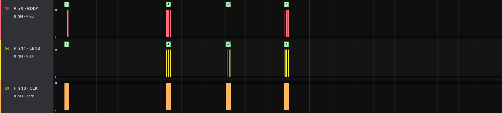
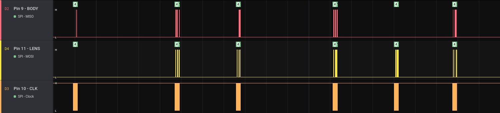

# GF Protocol Notes

Sniffing of the communications between the body and lens is achieved with a modified MCEX-45G, and builds from the basic electrical analysis described in [the electrical README](/electrical).

### Logic Analyser Captures

Useful trace files are committed to the `captures` folder.

These files require Saleae's Logic 2 tool for viewing. It's freely available for download on their website [here](https://www.saleae.com/downloads/).

Specific packets or sections of interest are converted into a more digestible form and are saved in `/packet-captures` as hex encoded binary files.


# SPI Communication

We can make the assumption about the specific IN/OUT pins because there ares in the logic captures which show one-way initial send packets, and occasional one-way responses.


Based on this, we can assume that:

- Pin 9 is body's DATA OUT line.
- Pin 10 is a 1.5MHz SPI-style clock signal.
- Pin 11 is the body's DATA IN line.

With this in mind, we now aim to identify the properties of the communications bus and determine if it's typical SPI or some Fuji special sauce.

- A transaction consists of 32-bits at minimum
  - Almost all transactions are 32-bits long.
  - During startup, a pair of 1048-bit long transactions occur with a 3ms gap - these are the longest identified transactions.
  - As the division of  `1048` and the potential bits-per-transfer should be an integer, we can reasonably throw out `16` and `32` bit transfer sizes.

By manually inspecting logic captures, one example section helps determine the clock behaviour.

- The clock is high when inactive (CPOL = 1).

- Data is valid on the clock's trailing edge (CPHA = 1)

  - Demonstrated by the edges on the first falling edge, and on falling edges aligned to 8-bit sequences.

    


# Protocol Analysis


## Packet Structure

The last byte appears to be a checksum

## Checksum


# Packet Analysis


## Idle Packets

When the camera is powered on but is otherwise sitting idle, we see a burst of transactions occur every 40ms.

These packets represent the bulk of 'noise' when watching packet traces, so understanding, decoding and then filtering them represents a worthwhile effort.



| Transmission # | Camera                | Lens                  |
| -------------- | --------------------- | --------------------- |
| 1              | `0x00 0x00 0x08 0x20` | -                     |
| 2              | `0x?? 0x10 0x80 0x??` | `0x08 0x00 0x88 0x32` |
| 3              | -                     | `0x03 0x80 0x08 0x3C` |
| 4              | `0x08 0x00 0x88 0x??` | `0x?? 0x00 0x80 0x??` |

On every third burst, we have 2 additional transactions (6 total).



| Transmission # | Camera                | Lens                  |
| -------------- | --------------------- | --------------------- |
| 1              | `0x00 0x00 0x08 0x20` | -                     |
| 2              | `0x?? 0x10 0x80 0x??` | `0x08 0x00 0x88 0x32` |
| 3              | `0x00 0x00 0x09 0xA6` | `0x03 0x80 0x08 0x3C` |
| 4              | `0x?? 0x00 0x88 0x??` | `0x?? 0x00 0x89 0x??` |
| 5              | -                     | `0x00 0x15 0x09 0x9A` |
| 6              | `0x08 0x00 0x89 0xB8` | `0x?? 0x00 0x80 0x??` |

For both the 4 and 6 packet bursts, the first bytes marked as `0x??` seem to vary between subsequent bursts, but a random sampling of 5 bursts in a row gives a feel that they're not exhibiting packet counting behaviour.

The final bytes marked `0x??` are most likely a CRC.


## Identification Packets

After the camera is powered on, a series of `131B` transactions occur (each sent twice 3ms apart). Both transmissions appear to have identical payloads.

### GF45mm

The first transaction starts the first two bytes with `0x00 0x00`, and ends with `0xAF`.

The second transaction starts with `0xFF 0xFF` and ends with `0xAD`.

The payload (in hex) is:

```
4c52 3130 3641 0000 4653 534e 5730 3036
4746 3435 6d6d 4632 2e38 2052 2057 5200
0000 0000 0000 0000 0000 0000 0000 0000
0000 0000 0000 0000 0000 0000 0000 0000
0000 0000 0000 0000 0000 0000 0000 0000
3234 3033 3338 3636 3035 0156 0100 0100
0100 0100 c801 0000 0000 0000 0000 0000
0000 0000 0000 0000 0000 0000 0000 0000
```

These transactions are from the lens to the body and **describe the lens**. 

- The first section of data is ASCII: `LR106A  FSSNW006GF45mmF2.8 R WR` 
  - Not sure what the first half means yet.
  - The last half is obvious obvious, the lens is officially labelled as  `GF45mmF2.8 R WR`.
- The second block of data in the payload is `2403386605 V` `È` in ASCII, which isn't immediately obvious
  - TODO work out what this data means?

### GF110mm

The first transaction starts the first two bytes with `0x00 0x00`, and ends with `0x0B`.

The second transaction starts with `0xFF 0xFF` and ends with `0x09`.

The payload (in hex) is:

```
4c52 3130 3441 0000 4653 534e 5731 3034
4746 3131 306d 6d46 3220 5220 4c4d 2057
5200 0000 0000 0000 0000 0000 0000 0000
0000 0000 0000 0000 0000 0000 0000 0000
0000 0000 0000 0000 0000 0000 0000 0000
3035 4330 3030 3234 0000 0160 0110 0110
0110 0110 c801 0000 0000 0000 0000 0000
0000 0000 0000 0000 0000 0000 0000 0000
```

These transactions are from the lens to the body and **describe the lens**. 

- The first section of data is ASCII: `LR104A  FSSNW104GF110mmF2 R LM WR`
  - Not sure what the first half means yet.
  - The last half is obvious, the lens is officially labelled as `GF110mmF2 R LM WR`.
- The second block of data in the payload is `05C00024` `È` in ASCII
  - TODO work out what this data means

### GFX50R

> These body identification packets occur somewhat later than the lens identification packets, and only when the `GF110mm` is mounted.

The first transaction starts the first two bytes with `0x00 0x00`, and ends with `0x19`.

The second transaction starts with `0xFF 0xFF` and ends with `0x17`.

The payload (in hex) is:

```
5350 5833 0000 0000 0000 4746 5820 3530
5200 0000 0000 0000 0000 0000 0000 4746
5820 3530 5200 0000 0000 0000 0035 3933
3533 3433 3833 3633 3131 3831 3131 3339
3744 3031 3031 3130 3834 3102 2001 3501
0001 0001 0000 0000 0000 0000 0000 0000
0000 0000 0000 0000 0000 0000 0000 0000
0000 0000 0000 0000 0000 0000 0000 0000
```

These transactions are from the body to the lens and **describe the body.** 

- The first section of data is ASCII: `SPX3` `GFX 50R` `GFX 50R` (whitespace trimmed)
  - Unsure of what `SPX3` represents.
  - The repeated pair of `GFX 50R` string sequences match the body under test.
- The second section of data is unknown.
  - `59353438363118111397D010110841   5` in ASCII, with some unprintable bytes
  - Unknown data


## Iris Packets?

- What happens when the iris ring is rotated
- What happens when the camera wants to close the iris for exposure or photos


Starts when a packet we don't recognise prior to iris event `LOW` is found (manually).

The iris event was 275ms long.

Preceded by a standard set of IDLE 6-burst transmissions (coincidence or intentional?).

#### Packet 1 

Camera: `0x12 0x40 0x18 0xBA`

Lens: -

#### Packet 2

Camera: `0x09 0x10 0x80 0x2A`

Lens: `0x08 0x00 0x98 0xB6`

#### Packet 3

Camera:  `0x00 0x00 0x3F 0xC6` 

Lens: `0x12 0x40 0x18 0xBA`

##### Packet 4

Camera: `0x0A 0x00 0x98 0x86`

Lens: `0x09 0x00 0xBF 0xE0`

Iris line goes low

##### Packet 5

Camera:  `0x00 0x00 0x00 0x00`

Lens:  `0x00 0x00 0x3F 0xC6`

##### Packet 6

Camera:  `0x08 0x00 0xBF 0xD8`

Lens:  `0x0A 0x00 0x80 0x22`

##### Waiting

40ms gap starts, followed by idle packets at normal interval

`IDLE4` ` IDLE4` `IDLE6` `IDLE4` ` IDLE4` `IDLE6` 

Then iris line returns to `HIGH`.


